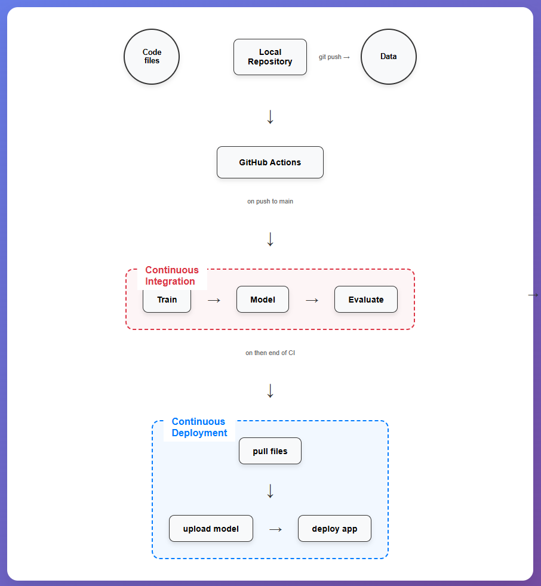

# Drug Classification Project

## Overview
This project builds a drug classification system using scikit-learn pipelines and Random Forest. The entire process, from training and evaluation to deployment, is automated using GitHub Actions and deployed to Hugging Face Hub.

## Pipeline


## Features
- Automated drug classification model training
- Automated model evaluation and report generation
- CI/CD pipeline with GitHub Actions
- Web application deployment to Hugging Face Spaces

## Project Structure
```
├── App/                    # Gradio web application
│   ├── drug_app.py         # Application source code
│   └── requirements.txt    # Dependencies for the application
├── Data/                   # Data
│   └── drug.csv            # Drug classification dataset
├── Model/                  # Directory for trained models
├── Results/                # Evaluation results
│   ├── metrics.txt         # Evaluation metrics
│   └── model_results.png   # Confusion matrix plot
├── workflows/              # GitHub Actions workflows
│   ├── ci.yml              # Continuous Integration
│   └── cd.yml              # Continuous Deployment
├── Makefile                # Automation commands
├── requirements.txt        # Project dependencies
└── train.py                # Model training source code
```

## Installation
```bash
# Clone repository
git clone <repository-url>
cd drug-classification

# Install dependencies
make install
```

## Usage
### Train the model
```bash
make train
```

### Evaluate the model
```bash
make eval
```

### Deploy to Hugging Face
```bash
make deploy HF=<huggingface-token>
```

### Run the entire pipeline
```bash
make all
```

## CI/CD Pipeline
The project uses GitHub Actions to automate:
1. **Continuous Integration (CI)**: Train and evaluate the model on code changes
2. **Continuous Deployment (CD)**: Deploy the application to Hugging Face Spaces

## Web Application
The web application is built with Gradio, allowing users to input patient parameters and predict the appropriate drug.

